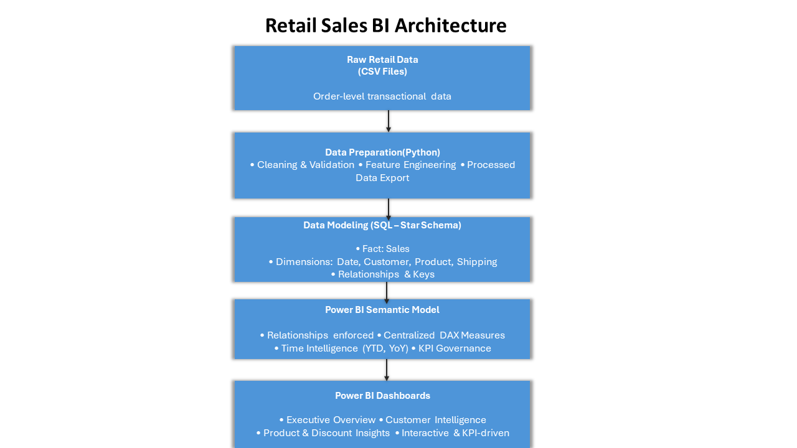

# 📊 Retail Sales Business Intelligence Dashboard (Power BI)


---

## 📖 Project Overview

This project delivers a **Production-grade, end-to-end Business Intelligence solution** for retail sales analytics built with **Python, SQL, Power BI, and DAX**.

The objective is to transform **raw transactional retail data** into **trusted, scalable, and executive-ready insights** that support decision-making across sales, marketing, and operations.

The solution follows **real-world BI engineering and analytics best practices**, including:

- Structured data preparation and validation
- Dimensional (star schema) modeling
- Centralized KPI and metric governance
- Advanced time-intelligence analytics
- Executive-focused dashboard storytelling

The final output is a **multi-page Power BI dashboard** designed for **executives, business leaders, and analysts**.

---

## 🧠 Solution Architecture

This project follows a **modern Business Intelligence (BI) architecture**, separating data preparation, modeling, analytics, and visualization layers to ensure **scalability, accuracy, and governance**.

### Architecture Overview

- **Data Layer:** Raw retail transaction data (CSV)
- **Processing Layer:** Python-based data cleaning and feature engineering
- **Modeling Layer:** SQL star schema (fact and dimension tables)
- **Analytics Layer:** Power BI semantic model with centralized DAX measures
- **Presentation Layer:** Interactive executive dashboards

## 📌 _This layered architecture mirrors real-world BI systems used in production environments and ensures consistent, governed business metrics._

### Architecture Diagram



---

## 🎯 Business Objectives

This dashboard enables stakeholders to answer key business questions such as:

- How is the business performing overall in terms of sales and profit?
- What are the **Year-to-Date (YTD)** and **Year-over-Year (YoY)** performance trends?
- Which customers contribute the most to revenue and profitability?
- Which product categories and sub-categories drive growth?
- How do discount strategies impact revenue, margins, and profit?
- Where should leadership focus to improve performance?

---

## 🗂️ Dataset Overview

### Dataset Summary

| Attribute     | Description              |
| ------------- | ------------------------ |
| Dataset Name  | Superstore Retail Sales  |
| Records       | 51,291 rows              |
| Features      | 21 columns               |
| Time Coverage | 2011 – 2014 (4 years)    |
| Granularity   | Order-level transactions |
| Data Quality  | Cleaned & validated      |
| Data Types    | Numeric & categorical    |

The dataset captures **global retail transactions**, including customer attributes, product hierarchies, shipping details, financial metrics, and geographic information.

---

### Dataset Schema

| Column         | Description             |
| -------------- | ----------------------- |
| order_id       | Unique order identifier |
| order_date     | Date order was placed   |
| ship_date      | Date order was shipped  |
| ship_mode      | Shipping method         |
| customer_name  | Customer name           |
| segment        | Customer segment        |
| state          | State                   |
| country        | Country                 |
| market         | Global market           |
| region         | Sales region            |
| product_id     | Product identifier      |
| category       | Product category        |
| sub_category   | Product sub-category    |
| product_name   | Product name            |
| sales          | Revenue generated       |
| quantity       | Units sold              |
| discount       | Discount applied        |
| profit         | Profit earned           |
| shipping_cost  | Shipping cost           |
| order_priority | Fulfillment priority    |
| year           | Order year              |

---

### Key Dataset Characteristics

#### Shipping Modes

- Standard Class: ~60%
- Second Class: ~20%
- Other modes: ~20%

#### Customer Segments

- Consumer: ~52%
- Corporate: ~30%
- Other segments: ~18%

#### Geographic Coverage

- Countries: 147 unique
- States: 1000+ unique
- Markets: APAC, LATAM, US, EMEA
- Largest Market: APAC (~21%)
- Largest Country: United States (~19%)

---

## 🧹 Data Preparation & Feature Engineering

Raw data was processed using **Python (Pandas & NumPy)** before loading into the analytical database.

### Data Cleaning Process

- Parsed order and shipping dates into standard datetime formats
- Standardized numeric fields (sales, profit, discounts, shipping cost)
- Converted quantities to integer values
- Removed duplicate records
- Removed invalid or incomplete transactions
- Ensured consistency across categorical fields

### Feature Engineering

The following analytical features were created to support BI insights:

- **Shipping Days** – Order fulfillment duration
- **Profit Margin** – Profitability efficiency metric
- **Discount Bands** – Grouped discount levels for impact analysis

Cleaned and enriched data was stored in a **processed data layer** for downstream modeling.

---

## 🧱 Data Architecture & Modeling

The project uses a **star schema architecture**, optimized for analytical performance and Power BI best practices.

### Fact Table

- **Sales** (`fact_sales_bi`)

### Dimension Tables

- **Date**
- **Customer**
- **Product**
- **Shipping**

### Modeling Best Practices

- One-to-many relationships (dimensions → fact)
- Single-direction filtering
- Surrogate keys for all dimensions
- Centralized DAX Measures table
- Hidden technical columns for a clean user experience
- Date dimension used for all time intelligence

This design ensures **scalability, performance, and metric consistency**.

---

## 🔄 Data & Analytics Workflow

1. Raw data ingestion (CSV)
2. Data cleaning and feature engineering (Python)
3. Storage in processed data layer
4. Schema and dimensional modeling (SQL)
5. Fact and dimension table creation
6. BI-ready SQL views for validation
7. Power BI data model creation
8. Centralized DAX measures
9. Dashboard development and validation

---

## 📐 Measures & Analytics Strategy

All business logic and KPIs are implemented using **DAX** and stored in a **dedicated Measures table**.

### Core KPIs

- Total Sales
- Total Profit
- Total Orders
- Average Order Value
- Profit Margin

### Time Intelligence

- Year-to-Date (YTD)
- Last Year (LY)
- Year-over-Year (YoY) Growth
- Monthly and yearly trends

All measures are fully slicer-aware and respond dynamically to Date, Customer, Product, and Geography filters.

---

## 📊 Dashboard Pages

### 1️⃣ Executive Overview

**Audience:** Senior Leadership

- Key KPIs (Sales, Profit, Orders)
- YTD & YoY performance
- Sales and profit trends
- Category contribution analysis

### 2️⃣ Customer Intelligence

**Audience:** Sales & Marketing Teams

- Top customers by sales and profit
- Revenue concentration
- Segment profitability
- Discount sensitivity insights

---

## ✅ Data Validation & Quality Assurance

- DAX measures validated against SQL aggregations
- Slicer interactions tested across all visuals
- No ambiguous or bidirectional relationships
- Clean and intuitive field list
- Consistent KPI definitions across pages

---

## 🔁 How to Reproduce This Project (Step-by-Step)

### Prerequisites

- Python 3.9+
- SQL database (PostgreSQL)
- Power BI Desktop
- Git

---

### Step 1: Clone the Repository

```bash
git clone https://github.com/Johnnysnipes90/retail-sales-bi-dashboard.git
cd retail-sales-bi-dashboard
```

---

2. Run Data Pipeline

- Place raw CSV in data/raw/
  Run:

```
python run_etl.py
```

- Output saved to data/processed/
- This step produces analytics-ready data for modeling.

---

Step 3: Database & SQL Modeling

- Create the database schema
- Execute SQL scripts in sql/schema/ to create fact and dimension tables
- Load processed data into the fact table
- Use SQL views in sql/views/ for validation and exploration

---

Step 4: Power BI Modeling

- Open Retail_Sales_BI_Dashboard.pbix
- Connect Power BI to the database
- Validate relationships align with the star schema
- Ensure all DAX measures live in the Measures table

---

Step 5: Dashboard Validation

- Test slicers (Date, Customer, Product, Geography)
- Validate KPI values against SQL results
- Confirm visuals respond correctly to filters

---

## 🛠️ Tools & Technologies

| Tool        | Purpose                             |
| ----------- | ----------------------------------- |
| Python      | Data cleaning & feature engineering |
| SQL         | Data modeling & transformations     |
| Power BI    | Analytics & visualization           |
| DAX         | KPIs & time intelligence            |
| Power Query | Data shaping                        |
| GitHub      | Version control & portfolio         |

---

## 📂 Repository Structure

```
retail-sales-bi-dashboard/
│
├── data/
│ ├── raw/ # Original source data
│ │ └── superstore_sales_clean.csv
│ │
│ └── processed/ # Cleaned & enriched data
│  └── fact_sales_clean.csv
│
├── src/
│   └── sales_etl.py
│
│
├── sql/
│ ├── schema/ # Star schema definitions
│ │ ├── dim_date.sql
│ │ ├── dim_customer.sql
│ │ ├── dim_product.sql
│ │ ├── dim_shipping.sql
│ │ └── fact_sales_bi.sql
│ │
│ └── views/ # BI-ready analytical views
│ ├── vw_kpi_summary.sql
│ ├── vw_monthly_sales.sql
│ ├── vw_customer_intelligence.sql
│ ├── vw_product_performance.sql
│ └── vw_discount_performance.sql
│
├── powerbi/
│ └── Retail_Sales_BI_Dashboard.pbix
│
├── assets/
│ ├── architecture_diagram.png
│ └── dashboard_screenshots/
│
├── run_etl.py
├── requirements.txt
├── README.md
└── LICENSE
```

---

## 📈 Business Value Delivered

This solution enables:

- Faster executive decision-making
- Clear visibility into revenue and profit drivers
- Identification of high-value customers
- Smarter pricing and discount strategies
- A scalable foundation for future analytics

---

## 👤 Author

**Olalemi John Oluwatosin**  
Business Intelligence Analyst | Data Analyst

📧 Email: **johnolalemi90@gmail.com**  
🔗 LinkedIn: https://www.linkedin.com/in/john-olalemi  
🔗 GitHub: https://github.com/Johnnysnipes90

---

## 🏁 Final Notes

This project mirrors **real-world Business Intelligence delivery standards used in enterprise environments.**, combining data engineering, analytical modeling, and executive storytelling. It demonstrates how scalable, governed, and decision-focused BI solutions are built in modern data-driven organizations.
